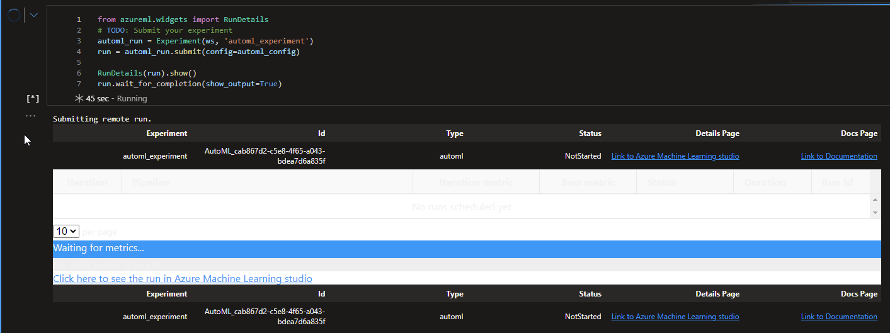

# Stroke Prediction Utility - Chad Puterbaugh

This project is meant to provide a utility to predict whether a patient with given demographic data is likely to develop a stroke. The data is sourced confidentially, but available via kaggle as linked in the Dataset section. This utility starts with a csv, and ends with a functional API endpoint where users can submit health information and receive a prediction on whether the demographic information represents someone likely to develop a stroke. 

## Project Set Up and Installation
This project requires no special instructions to set up. Simply initialize a compute, and run the automl.ipynb. Do not run the final cell if you intend to leave the API up and running. 

## Dataset

### Overview

Per Kaggle: 
According to the World Health Organization (WHO) stroke is the 2nd leading cause of death globally, responsible for approximately 11% of total deaths.
This dataset is used to predict whether a patient is likely to get stroke based on the input parameters like gender, age, various diseases, and smoking status. Each row in the data provides relavant information about the patient.
https://www.kaggle.com/datasets/fedesoriano/stroke-prediction-dataset

The dataset has the following dimensions:
1. id: unique identifier
1. gender: "Male", "Female" or "Other"
1. age: age of the patient
1. hypertension: 0 if the patient doesn't have hypertension, 1 if the patient has hypertension
1. heart_disease: 0 if the patient doesn't have any heart diseases, 1 if the patient has a heart disease
1. ever_married: "No" or "Yes"
1. work_type: "children", "Govt_jov", "Never_worked", "Private" or "Self-employed"
1. Residence_type: "Rural" or "Urban"
1. avg_glucose_level: average glucose level in blood
1. bmi: body mass index
1. smoking_status: "formerly smoked", "never smoked", "smokes" or "Unknown"*
1. stroke: 1 if the patient had a stroke or 0 if not
*Note: "Unknown" in smoking_status means that the information is unavailable for this patient

### Task
Initially, all 'N/A' remarks in columns are converted to `np.nan`'s, and all observations with NA's are blanket removed. All numeric columns are converted to numeric, the `id` column is removed, and the data is then saved in parquet format in the default datastore, and finally registered as a dataset `stroke-dataset`. 

For the `AutoML` job, this is as far as the data cleanup goes. `AutoML` performs featurization and achieves a very high accuracy. 

For the `hyperdrive` job, I perform a bit more featurization in `train.py`. `gender`, `ever_married`, and `Residence_type` are each converted into a binary integer (0 or 1) representation. Further, I perform one-hot encoding on `work_type` and `smoking_status`. 

### Access
The Kaggle data I used was accessed in May of 2022, and is provided as part of the package. 

## Automated ML
```
automl_settings = {
    "experiment_timeout_minutes": 20,
    "max_concurrent_iterations": 4, 
    "primary_metric" : 'AUC_weighted'
}
```
`experiment_timeout_minutes` was selected to prevent any runaway experiments from being unfeasible economically.
`max_concurrent_iterations` was capped at 4 to match the number of nodes in the compute instance
`primary_metric` was set to `AUC_weighted` to reflect that the a positive stroke prediction is much rarer in the dataset than the negative case.
See: https://docs.microsoft.com/en-us/azure/machine-learning/how-to-configure-auto-train#primary-metric

```
automl_config = AutoMLConfig(compute_target=compute_target,
                             task = "classification",
                             training_data=dataset,
                             label_column_name="stroke",   
                             path = project_folder,
                             enable_early_stopping= True,
                             featurization= 'auto',
                             debug_log = "automl_errors.log",
                             **automl_settings
                            )
```
The primary configurations worth noting in the `AutoMLConfig` are:
`task` this is a binary classification problem
`training_data` points to the dataset that was registered representing the cleaned stroke data
`label_column_name` as 'stroke' is the outcome variable we are trying to predict
`enable_early_stopping` allows any experiments to stop early to save compute costs
`featurization` set to `auto` allows AutoML to attempt to find the best set of features to represent the data

See: https://docs.microsoft.com/en-us/azure/machine-learning/how-to-configure-auto-train

### Results

The AutoML model performed much better than my hyperdrive run with a balanced accuracy of `AUC_Weighted:  0.8485172440280295`. The best performing model was an ensemble model consisting of 11 models and the following weights:

+ StandardScalarWrapper, XGBoostClassifier - .06667
+ StandardScalarWrapper, RandomForestClassifier - .06667
+ SparseNormalizer, XGBoostClassifier - .2
+ StandardScalarWrapper, XGBoostClassifier - .06667
+ MaxAbsScalar, LogisticRegression - .06667
+ StandardScalarWrapper, XGBoostClassifier - .06667
+ StandardScalarWrapper, ExtraTreesClassifier - .06667
+ MaxAbsScalar, LogisticRegression - .06667
+ MaxAbsScalar, LightGBMClassifier - .2
+ SparseNormalizer, RandomForestClassifier - .06667
+ StandardScalarWrapper, LightGBMClassifier - .06667

The model could be improved as more data is collected. Similarly, more care to ensure that a balance of classes are represented in the data could yield better accuracy. The data itself could be better contextualized to represent when the observation actually developed the stroke as it is currently unclear. 

*TODO* Remeber to provide screenshots of the `RunDetails` widget as well as a screenshot of the best model trained with it's parameters.



## Hyperparameter Tuning

The algorithm I chose is a logistic regression for binary classification. 
`model = LogisticRegression(C=args.C, max_iter=args.max_iter, class_weight='balanced').fit(x_train, y_train)`
I chose to feed `C` and `max_iter` to hyperdrive, but due to the class imbalance, I used `class_weight='balanced'` to automatically adjust weights during regression. See https://scikit-learn.org/stable/modules/generated/sklearn.linear_model.LogisticRegression.html?highlight=logistic#sklearn.linear_model.LogisticRegression
The scope of the problem aims to predict whether a set of demographics will predict the onset of a stroke. Because the positive class is not as well represented, I opted to use a balanced accuracy score to optimize, but still capture overall accuracy. 
Balanced Accuracy is supplied to the job through logging:
`run.log("balanced_accuracy", balanced_accuracy_score(y_test, y_pred))`
And set as the primary metric in the run config.

```
hyperdrive_run_config = HyperDriveConfig(
    run_config=estimator,
    hyperparameter_sampling=param_sampling,
    primary_metric_name="balanced_accuracy", 
    primary_metric_goal=PrimaryMetricGoal.MAXIMIZE,
    max_total_runs=40
)
```
See: https://neptune.ai/blog/balanced-accuracy

I used a bayesian parameter sampler to feed the `C` and `max_iter` hyperparameters to the training script. 
`
param_sampling = BayesianParameterSampling(
    {'C': uniform(0.001, 10.0),
    'max_iter': choice([500, 1000, 1500, 2000, 2500, 5000])}
)
`
giving uniform probability to `C` from .001 to 10.0, and a discrete set of choices for `max_iter'. 

### Results

The resulting model after hyperparameter turning yielded a balanced accuracy of .8195. The parameters that the optimal model utilized is a `C` value of 6.703 and a `max_iter` of 500. If I were to study this problem longer, I would play with more parameters within logitistic regression, but also I would have tried a few other algorithms, such as random forest. I would have also liked to play more with the max_iter parameter because the higher level of iterations tended to perform worse much more regularly than the smaller number of iterations. I'd like to adjust the hyperparameter sampler to reflect that. 


## Model Deployment

The deployed model takes a parameter per column of the original dataset, and returns a binary 1 or 0 as a prediction result for whether the arguments represent someone as likely to develop a stroke. The model is deployed with a score file and an environment as an Azure Container Instance. That container then is set up as an endpoint to receive data in a format that looks like this:
```
data =  {
  "Inputs": {
    "data": [
      {
        "gender": "Male",
        "age": 67,
        "hypertension": 0,
        "heart_disease": 1,
        "ever_married": "Yes",
        "work_type": "Private",
        "Residence_type": "Urban",
        "avg_glucose_level": 228.69,
        "bmi": 36.6,
        "smoking_status": "formerly smoked"
      },
    ]
  },
  "GlobalParameters": {
    "method": "predict"
  }
}
```
One would query the endpoint by hitting the endpoint with a payload defined as seen above, and structured into a request as seen below:
```
uri = service.scoring_uri
headers = {"Content-Type": "application/json"}
data = json.dumps(data)
response = requests.post(uri, data=data, headers=headers)
print(response.json())
```

The model's environment dependencies are located in `conda_env_v_1_0_0.yml`

This shows the model deployed:


This shows the model registered:


This shows the model endpoint up and healthy:


## Screen Recording

[](https://www.youtube.com/watch?v=eHw1Zxktemw)

- A working model
- Demo of the deployed  model
- Demo of a sample request sent to the endpoint and its response

## Standout Suggestions
*TODO (Optional):* This is where you can provide information about any standout suggestions that you have attempted.
